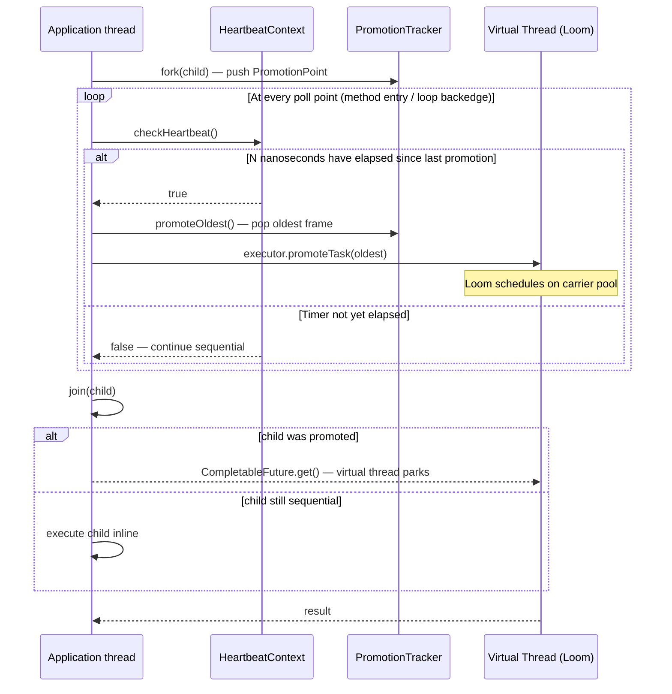

# Heartbeat Scheduling for Java

A working implementation of the Heartbeat Scheduling algorithm (Acar et al., PLDI 2018) in modern Java — runtime + Project Loom integration + an ASM-based bytecode rewriter that auto-inserts heartbeat polls (the paper's PRC transformation, ported to JVM tooling) — with empirical benchmarks designed to verify the (1 + τ/N) overhead bound on real workloads.

---

## Why this exists

The [paper](https://www.andrew.cmu.edu/user/mrainey/papers/heartbeat.pdf) proves that a scheduler which "promotes" sequential continuations to parallel threads at a regular heartbeat interval delivers:

- **Bounded work overhead**: W ≤ (1 + τ/N) × w
- **Bounded span increase**: S ≤ (1 + N/τ) × s

where τ is the promotion cost, N is the heartbeat period, w is the sequential work, and s is the ideal-parallel span.  Setting N = 20τ gives 5% work overhead and a 21× span bound — no manual tuning required.

The interesting part is that these guarantees require the compiled code to satisfy a structural property called *Promotion-Ready Code* (PRC): every execution path of length N must contain a poll point.  Most implementations leave the poll insertion as an exercise; this repo implements it as a Java agent that rewrites bytecode at load time.

---

## Algorithm overview



The key insight: tasks start *sequential* and are promoted lazily only when the heartbeat fires.  Short computations finish before the first promotion and pay zero parallel overhead; long computations get distributed across carrier threads as work accumulates.

---

## Quick start

```bash
# Requirements: Java 25+, Maven 3.6+

# Build and run tests
mvn clean test

# Run the Fibonacci example (n=35; recursive tasks use a sequential leaf cutoff)
java --add-exports java.base/jdk.internal.vm=ALL-UNNAMED \
     -cp target/classes \
     org.heartbeat.scheduler.examples.FibonacciExample 35

# Run the same example with the PRC agent — no manual poll calls in user code
mvn package -DskipTests
java --add-exports java.base/jdk.internal.vm=ALL-UNNAMED \
     -javaagent:target/heartbeat-scheduler-0.1.0-SNAPSHOT-agent.jar \
     -cp target/classes \
     org.heartbeat.scheduler.examples.FibonacciExample 35

# Other runtime examples
java --add-exports java.base/jdk.internal.vm=ALL-UNNAMED \
     -cp target/classes \
     org.heartbeat.scheduler.examples.ParallelSumExample 100000
java --add-exports java.base/jdk.internal.vm=ALL-UNNAMED \
     -cp target/classes \
     org.heartbeat.scheduler.examples.RecursiveSumExample 100000

# Run benchmarks (generates docs/results/jmh-results.json)
mvn test-compile exec:java -Pbenchmarks

# Generate result plots (requires: pip install matplotlib)
python scripts/plot-results.py docs/results/jmh-results.json
```

---

## Project Loom integration

Virtual threads (Project Loom) serve two roles here:

1. **Promoted tasks** run as virtual threads scheduled on a `ForkJoinPool` of carrier platform threads.
2. **Blocking joins** (a parent waiting for a promoted child's `CompletableFuture`) unmount the virtual thread from its carrier, freeing the carrier to execute other tasks.

We deliberately delegate work-stealing to Loom's carrier scheduler rather than implementing a custom Chase-Lev deque.  This gives us a production-quality, battle-tested work distributor at the cost of some control over task locality.

Key design notes are in [`docs/loom-integration.md`](docs/loom-integration.md):
pinning behaviour, safepoint interaction, JIT inlining of `checkHeartbeat()`, and the tradeoff between control and simplicity.

---

## PRC bytecode rewriter

The paper's compile-time transformation — inserting poll points so that every execution path of length N contains at least one check — is implemented as a Java agent in [`src/main/java/org/heartbeat/scheduler/agent/`](src/main/java/org/heartbeat/scheduler/agent/).

**How it works:**

1. The agent attaches via `java.lang.instrument` and registers a `ClassFileTransformer`.
2. For each class loaded at runtime, it scans for methods annotated with `@Parallel`.
3. For each `@Parallel` method, `PrcRewriter` (built on ObjectWeb ASM) inserts an
   `INVOKESTATIC HeartbeatContext.checkHeartbeatStatic()` call at:
   - **Method entry** — the first basic block always polls before doing real work.
   - **Loop backedges** — identified via dominator-tree analysis (`BackedgeAnalyzer`):
     edge (u → v) is a backedge iff v dominates u in the CFG.
     The CFG models ordinary jumps plus `TABLESWITCH` and `LOOKUPSWITCH`
     targets, and stores dominator sets as `BitSet`s.

**Controlling poll density** — `@HeartbeatPoll(every=N)` on a method inserts a backedge poll only at every N-th backedge (0-indexed, ascending order).  The entry poll is always present.  Use this to reduce instrumentation overhead in tight inner loops where the heartbeat timer fires far less frequently than every iteration:

```java
@Parallel
@HeartbeatPoll(every = 4)   // poll at backedges 0, 4, 8, … instead of every one
public void tightLoop(int[] arr) { … }
```

**Before / after example** — a `@Parallel` method with a loop:

```
// Before instrumentation
ICONST_0        // i = 0
ISTORE_1
ILOAD_1         // ← loop header (target of backedge)
ILOAD_2
IF_ICMPGE L2    // exit if i >= limit
... loop body ...
IINC 1 1        // i++
GOTO L1         // backedge

// After PRC rewriting
INVOKESTATIC HeartbeatContext.checkHeartbeatStatic()Z  // ← entry poll
POP
ICONST_0
ISTORE_1
ILOAD_1         // ← loop header
ILOAD_2
IF_ICMPGE L2
... loop body ...
IINC 1 1
INVOKESTATIC HeartbeatContext.checkHeartbeatStatic()Z  // ← backedge poll
POP
GOTO L1
```

`ClassWriter.COMPUTE_FRAMES` regenerates `StackMapTable` entries automatically, avoiding the most common bytecode-rewriting pitfall.

Full design rationale in [`docs/prc-rewriter.md`](docs/prc-rewriter.md).

---

## Observability

Three JFR custom events are emitted at key points in the scheduler lifecycle:

| Event | When fired | Key fields |
|---|---|---|
| `PromotionEvent` | A task is promoted to a virtual thread | carrier name, frame age (ns), frames in-flight |
| `PollCheckEvent` | `checkHeartbeat()` decides to promote | total polls, total promotions |
| `JoinBlockedEvent` | A parent parks waiting for a promoted child | carrier name, task age (ns) |

The default `HeartbeatObserver.NOOP` keeps the runtime decoupled from JFR and emits nothing.  When `JfrHeartbeatObserver` is configured, each JFR event checks `isEnabled()` before filling fields, beginning duration events, or committing.

The observability backend is pluggable via `HeartbeatObserver`.  The default is `HeartbeatObserver.NOOP`; opt in to JFR by passing `JfrHeartbeatObserver.INSTANCE`:

```java
HeartbeatConfig config = HeartbeatConfig.newBuilder()
    …
    .observer(JfrHeartbeatObserver.INSTANCE)
    .build();
```

Visualise a recording with `scripts/visualize-jfr.py` (produces a Gantt-style chart of promotions per carrier thread over time).  The recording must come from a run configured with `JfrHeartbeatObserver.INSTANCE`; the script exits non-zero if the recording contains no heartbeat events so CI does not silently accept an empty chart.

---

## Empirical verification

### Why backedges + method entries suffice

The paper proves (§3) that inserting polls at loop backedges and recursive call sites is sufficient to make code PRC.  Every natural loop in the CFG passes through a backedge; every recursive descent passes through a method entry.  Any execution path of length N must traverse one of these points.  The JVM analyzer handles `GOTO`, conditional jumps, `TABLESWITCH`, and `LOOKUPSWITCH`; exception-handler edges and irreducible CFGs are documented test cases rather than optimized paths.

### Running the bounds sweep

`BoundsBench` sweeps N over {2τ, 5τ, 10τ, 20τ, 50τ, 100τ} where τ is measured at trial setup via `TimingCalibration.estimateVirtualThreadCost()`.  Both heartbeat and sequential Fibonacci(30) are benchmarked at each point.  The ratio heartbeat_time / sequential_time is a direct proxy for W/w (on a single carrier, wall-clock = CPU work).

```bash
mvn test-compile exec:java -Pbenchmarks \
  -Dexec.args="BoundsBench -rf json -rff docs/results/bounds.json"

python scripts/plot-results.py docs/results/bounds.json --type bounds
# → docs/results/bounds-verification.png
```

The expected shape: data points should cluster on or below the line y = 1 + τ/N.
With small N (N = 2τ, theoretical 50% overhead) points are above y = 1 by ~50%.
With large N (N = 100τ, theoretical 1% overhead) points converge toward y = 1.

### Scalability curves

`ComparativeBench` compares heartbeat vs `ForkJoinPool` vs sequential on Fibonacci(35)
while sweeping {1, 2, 4, 8} for the direct `ForkJoinPool` baseline:

```bash
mvn test-compile exec:java -Pbenchmarks \
  -Dexec.args="ComparativeBench -rf json -rff docs/results/comparative.json"

python scripts/plot-results.py docs/results/comparative.json --type scalability
# → docs/results/scalability.png
```

The heartbeat executor uses `Executors.newVirtualThreadPerTaskExecutor()`, so its carrier count is controlled by Loom's JVM-global `-Djdk.virtualThreadScheduler.parallelism=N`, not by an executor-local setting.

> **Results are generated locally** — run the commands above to produce the plots.
> The scripts are ready; the `docs/results/` directory holds the output.

---

## What's done / what's not

| Component | Status |
|---|---|
| Core runtime (Phases 1–4): HeartbeatConfig, HeartbeatTimer, PollingStrategy, PromotionTracker, VirtualThreadExecutor | ✅ done |
| 15 correctness fixes: task reference in PromotionPoint, race-free join, AutoCloseable shutdown, configurable polling, cached JDK scope | ✅ done |
| Example programs: FibonacciExample, ParallelSumExample, RecursiveSumExample | ✅ done |
| PRC bytecode rewriter: BackedgeAnalyzer, PrcRewriter, PrcAgent, PrcClassTransformer | ✅ done |
| @Parallel / @HeartbeatPoll annotations | ✅ done |
| JFR custom events: PromotionEvent, PollCheckEvent, JoinBlockedEvent | ✅ done |
| JFR visualizer: scripts/visualize-jfr.py | ✅ done |
| Pluggable HeartbeatObserver (NOOP / JfrHeartbeatObserver); JFR `isEnabled()` checks before event work | ✅ done |
| JMH benchmark suite: FibBench, QuicksortBench, MatmulBench, BfsBench | ✅ done |
| Shared AbstractHeartbeatBench base + bench/Tasks.java (calibrated config, no duplication) | ✅ done |
| Bounds-verification benchmark (BoundsBench, τ/N sweep) | ✅ done |
| Comparative benchmark harness (ComparativeBench) | ✅ done |
| Result plotting: scripts/plot-results.py | ✅ done |
| @HeartbeatPoll(every=N) wired into PrcRewriter; ASM 9.9.1; catch(Throwable) in transformer | ✅ done |
| Code-review polish: BitSet dominators, switch backedges, bootstrap/platform loader skips, empty-JFR failure, Surefire fork timeout | ✅ done |
| Custom Chase-Lev work-stealing deque | ❌ not done (delegated to Loom — see docs/loom-integration.md) |
| DSL frontend (Cilk-Lite surface language) | ❌ not done |
| Annotation processor (AOT path) | ❌ not done (agent path is sufficient; AOT deferred) |

---

## Configuration reference

```java
// Recommended: machine-calibrated τ measured at startup
TimingCalibration.CalibrationResults cal = TimingCalibration.calibrate();

HeartbeatConfig config = HeartbeatConfig.newBuilder()
    .heartbeatPeriodNanos(cal.recommendedHeartbeatPeriod())  // 20τ → ~5% overhead
    .promotionCostNanos(cal.promotionCost())                 // τ measured on this JVM
    .enableStatistics(true)
    .build();

// Or target a specific overhead percentage (computes N = (100/k) × τ):
HeartbeatConfig config = HeartbeatConfig.newBuilder()
    .promotionCostNanos(cal.promotionCost())
    .targetOverheadPercent(5.0)   // N = 20τ
    .build();

// Or with explicit time-based polling (fires a timer check every N nanos):
HeartbeatConfig config = HeartbeatConfig.newBuilder()
    .heartbeatPeriodNanos(cal.recommendedHeartbeatPeriod())
    .promotionCostNanos(cal.promotionCost())
    .pollingStrategyFactory(() -> TimeBasedPolling.forHeartbeatPeriod(
            cal.recommendedHeartbeatPeriod()))
    .build();
```

Virtual-thread carrier count is controlled by Loom's JVM-global scheduler
setting, not by `HeartbeatConfig`. Use `-Djdk.virtualThreadScheduler.parallelism=N`
when launching a benchmark or example that needs a fixed carrier count.

---

## Future work

- **DSL frontend** — a Cilk-Lite surface language compiled to the heartbeat runtime would push the repo from "compiler-adjacent" into a full compiler pipeline (parser → AST → type-checker → bytecode codegen via ASM).
- **Deeper Loom inspection** — JIT inlining of `checkHeartbeat()` via `-XX:+PrintInlining`, `@Contended` annotations on hot fields, `ScopedValue` migration once GA.
- **Annotation processor** — AOT path: the same PRC transformation run at `javac` time rather than agent time.
- **Phases 5/6 from the original plan** — a custom Chase-Lev work-stealing deque (lock-free data structures practice) and a `parallelFor` API.

---

## References

- Acar, Charguéraud, Guatto, Rainey, Sieczkowski. *Heartbeat Scheduling: Provably Efficient Nested Parallelism*. PLDI 2018. [[PDF]](https://www.andrew.cmu.edu/user/mrainey/papers/heartbeat.pdf)
- JEP 444: Virtual Threads. [[link]](https://openjdk.org/jeps/444)
- JEP 451: Prepare to Disallow the Dynamic Loading of Agents. [[link]](https://openjdk.org/jeps/451)
- ObjectWeb ASM. [[docs]](https://asm.ow2.io/)
- JMH — Java Microbenchmark Harness. [[link]](https://github.com/openjdk/jmh)
